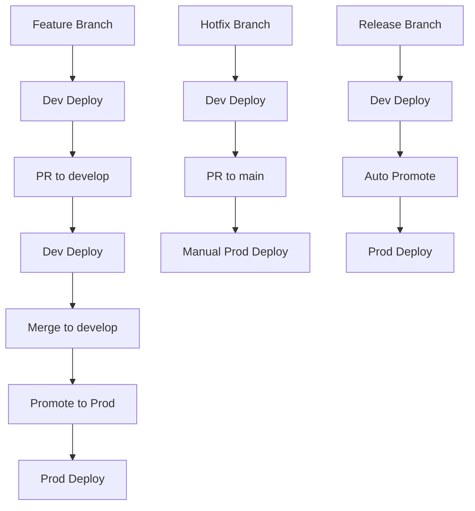

# Branching Strategy & Automation Guide

## 🌳 Git Flow Strategy

This project uses a modified Git Flow approach with clear separation between development and production environments.

### **Branch Structure**

```
main                    # Production-ready code
├── develop             # Staging/Integration environment
├── feature/*           # Feature development
├── hotfix/*            # Emergency production fixes
├── release/*           # Release preparation
└── bugfix/*            # Bug fixes
```

## 🔄 Workflow Triggers

### **Development Environment (`deploy-dev.yml`)**

**Triggers:**
- ✅ **Auto**: Push to `develop`, `feature/*`, `hotfix/*`
- ✅ **Auto**: Pull requests to `develop`
- ✅ **Manual**: Workflow dispatch

**Purpose:**
- Fast iteration and testing
- Feature branch validation
- Hotfix verification

**Environment:**
- **Cluster**: `practice-node-app-dev`
- **Repository**: `practice-node-app-dev`
- **Namespace**: `practice-app-dev`

### **Production Environment (`deploy-prod.yml`)**

**Triggers:**
- ✅ **Manual**: Workflow dispatch (with approval)
- ✅ **Auto**: GitHub releases

**Purpose:**
- Production deployments
- Release management
- Manual control and safety

**Environment:**
- **Cluster**: `practice-node-app-prod`
- **Repository**: `practice-node-app-prod`
- **Namespace**: `practice-app-prod`

### **Production Promotion (`promote-to-prod.yml`)**

**Triggers:**
- ✅ **Manual**: Workflow dispatch (with approval)
- ✅ **Auto**: Push to `release/*` branches

**Purpose:**
- Promote tested code from develop to production
- Controlled release process
- Rollback capabilities

## 🛡️ Safety Controls

### **Production Safety**
```yaml
# Manual approval required
approve_deployment:
  description: 'Type "approve" to confirm production deployment'
  required: true
  default: 'cancel'
```

### **Infrastructure Changes**
```yaml
# Auto-plan on PR, manual apply
terraform-plan.yml:  # Auto on PR to develop
terraform-apply.yml: # Manual with environment selection
```

## 📋 Branch Usage Guidelines

### **`main` Branch**
- **Purpose**: Production-ready code
- **Protection**: ❌ No auto-deployment
- **Access**: Pull requests only
- **Triggers**: Manual production deployment

### **`develop` Branch**
- **Purpose**: Integration and staging
- **Auto-deployment**: ✅ Development environment
- **Source**: For production promotion
- **Protection**: Pull requests required

### **`feature/*` Branches**
- **Purpose**: Feature development
- **Auto-deployment**: ✅ Development environment
- **Lifecycle**: Delete after merge
- **Naming**: `feature/feature-name`

### **`hotfix/*` Branches**
- **Purpose**: Emergency production fixes
- **Auto-deployment**: ✅ Development environment
- **Target**: Merge to both `develop` and `main`
- **Priority**: Immediate attention required

### **`release/*` Branches**
- **Purpose**: Release preparation
- **Auto-promotion**: ✅ To production (with approval)
- **Lifecycle**: Tag and merge to `main`
- **Naming**: `release/v1.2.0`

## 🚀 Deployment Workflow

### **Feature Development**
```bash
1. Create feature branch: git checkout -b feature/new-feature develop
2. Develop and test locally
3. Push to feature/* → Auto-deploy to dev
4. Create PR to develop → Auto-deploy to dev
5. Merge to develop → Auto-deploy to dev
```

### **Production Release**
```bash
# Option A: Manual Promotion
1. Ensure develop is stable
2. Run promote-to-prod.yml workflow
3. Approve promotion
4. Deploy to production

# Option B: Release Branch
1. Create release branch: git checkout -b release/v1.2.0 develop
2. Finalize release
3. Push to release/* → Auto-promote to production
4. Tag and merge to main
```

### **Emergency Hotfix**
```bash
1. Create hotfix from main: git checkout -b hotfix/critical-fix main
2. Fix issue and test
3. Push to hotfix/* → Auto-deploy to dev
4. Create PR to main and develop
5. Merge to both → Manual production deployment
```

## 🔍 Automation Matrix

| Branch | Infra Plan | Infra Apply | Dev Deploy | Prod Deploy | Promotion |
|--------|------------|-------------|------------|------------|----------|
| `main` | ❌ Manual | ❌ Manual | ❌ No | ✅ Manual | ❌ No |
| `develop` | ✅ Auto | ❌ Manual | ✅ Auto | ❌ No | ✅ Manual |
| `feature/*` | ✅ Auto | ❌ Manual | ✅ Auto | ❌ No | ❌ No |
| `hotfix/*` | ✅ Auto | ❌ Manual | ✅ Auto | ✅ Manual | ✅ Manual |
| `release/*` | ✅ Auto | ❌ Manual | ✅ Auto | ✅ Auto | ✅ Auto |

## 📊 Environment Comparison

| Feature | Development | Production |
|---------|-------------|-------------|
| **Branch** | `develop`, `feature/*` | `main`, `release/*` |
| **Deployment** | Automatic | Manual/Approved |
| **Replicas** | 1 | 3 |
| **Resources** | Minimal | High |
| **Monitoring** | Basic | Advanced |
| **Security** | Basic | Enhanced |
| **Testing** | Unit/Smoke | Full + Performance |

## 🔄 CI/CD Pipeline Flow



## 🛠️ Best Practices

### **Branch Management**
- Keep `main` clean and production-ready
- Use descriptive branch names
- Delete merged feature branches
- Protect `main` and `develop` branches

### **Commit Messages**
```
feat: add user authentication
fix: resolve memory leak in API
docs: update deployment guide
hotfix: critical security patch
release: prepare v1.2.0
```

### **Pull Requests**
- Include description and testing steps
- Ensure CI/CD passes
- Request code review
- Link to relevant issues

### **Deployment Safety**
- Never auto-deploy to production
- Always test in development first
- Use promotion workflow for releases
- Monitor production deployments

## 🚨 Emergency Procedures

### **Production Rollback**
```bash
# Option 1: GitHub Actions
# Run deploy-prod.yml with rollback

# Option 2: Manual
kubectl rollout undo deployment/practice-node-app-prod -n practice-app-prod
```

### **Infrastructure Recovery**
```bash
# Terraform state issues
cd infra/environments/prod
terraform force-unlock LOCK_ID

# Complete rebuild
./destroy-prod.sh
./setup-prod.sh
./apply-prod.sh
```

## 📈 Monitoring & Alerts

### **Development Environment**
- Basic health checks
- Unit test results
- Deployment status

### **Production Environment**
- Advanced health checks
- Performance metrics
- Error rates
- Resource utilization
- Security alerts

This branching strategy ensures safe, controlled deployments while maintaining development velocity and production stability.
